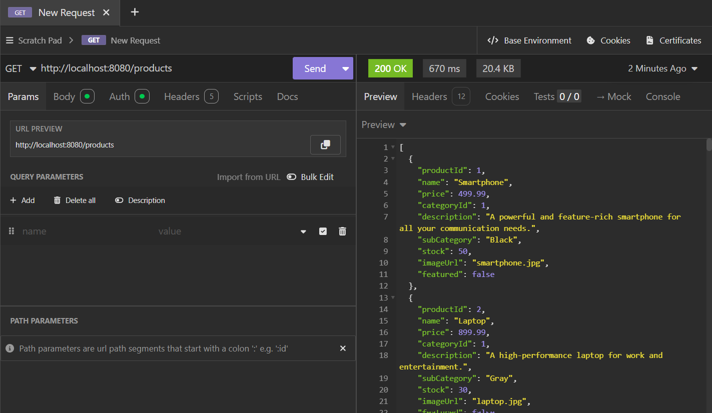
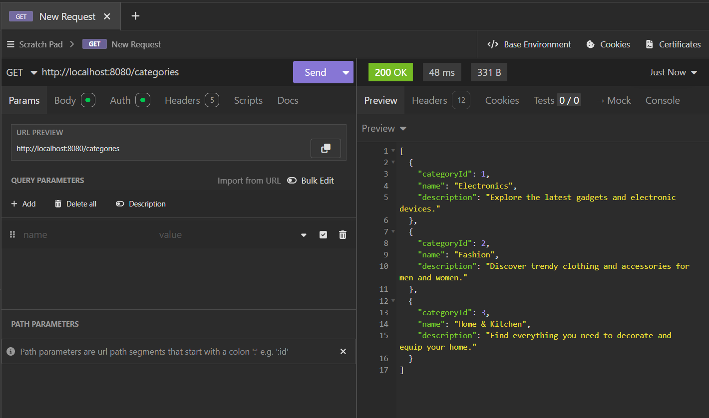
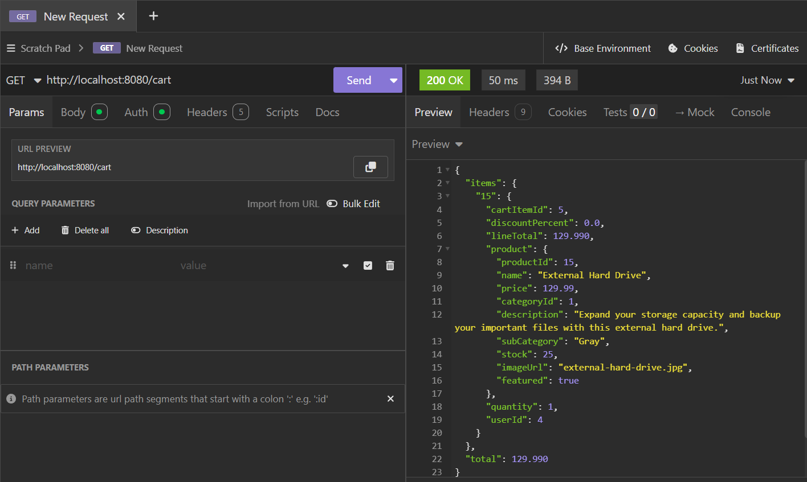
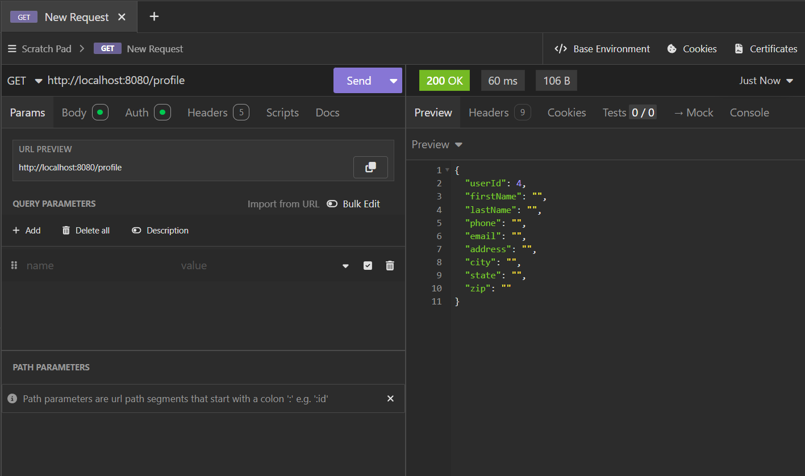
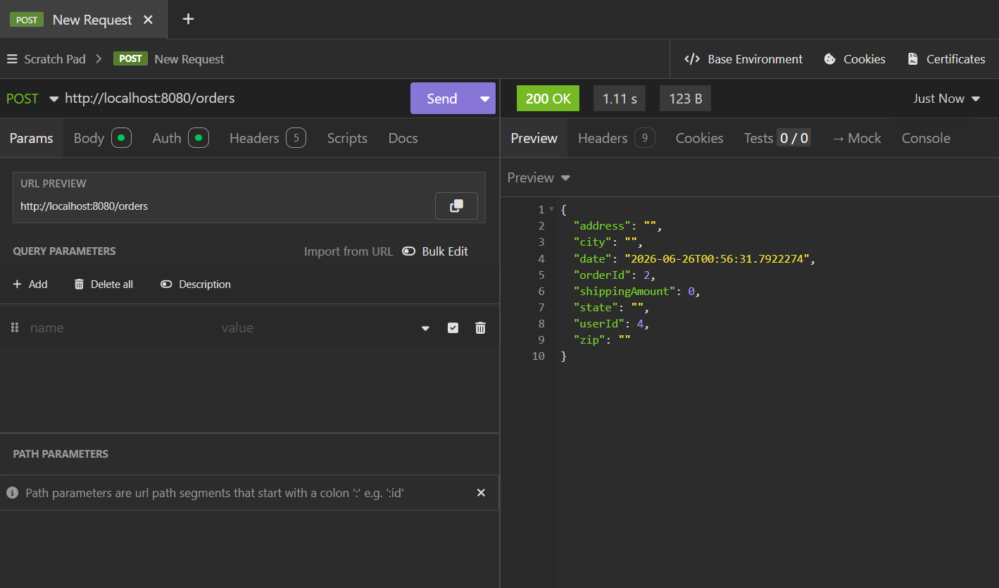

# 🛒 EasyShop E-Commerce API

A RESTful e-commerce application built with **Java**, **Spring Boot**, **Spring Security**, **Spring Data JPA**, and **MySQL**.

EasyShop allows users to browse products, manage a shopping cart, update their profile, and complete checkout by creating an order.

---

# 🛠 Technologies Used

- Java 17
- Spring Boot
- Spring Security (JWT)
- Spring Data JPA
- Hibernate
- MySQL
- Maven
- Insomnia
- Git & GitHub

---

# ✨ Features

- Browse and search products
- View product categories
- Manage a shopping cart
- Update user profile
- Checkout and create orders
- Save order line items
- Admin category management

---

# 📸 Application Screenshots

## Products



---

## Categories



---

## Shopping Cart



---

## User Profile



---

## Checkout



---

# ⭐ Interesting Code

The checkout feature is the core of the application. It retrieves the user's shopping cart, creates an order, creates an order line item for every product, copies the shipping information from the user's profile, and finally clears the shopping cart.

```java
public Order checkout(int userId) {

    List<CartItem> cartItems = shoppingCartRepository.findByUserId(userId);

    Profile profile = profileService.getByUserId(userId);

    Order order = new Order();
    order.setUserId(userId);
    order.setDate(LocalDateTime.now());
    order.setAddress(profile.getAddress());
    order.setCity(profile.getCity());
    order.setState(profile.getState());
    order.setZip(profile.getZip());
    order.setShippingAmount(BigDecimal.ZERO);

    Order savedOrder = orderRepository.save(order);

    for (CartItem cartItem : cartItems) {

        Product product = productService.getById(cartItem.getProductId());

        OrderLineItem lineItem = new OrderLineItem();
        lineItem.setOrderId(savedOrder.getOrderId());
        lineItem.setProductId(cartItem.getProductId());
        lineItem.setQuantity(cartItem.getQuantity());
        lineItem.setSalesPrice(product.getPrice());
        lineItem.setDiscount(BigDecimal.ZERO);

        orderLineItemRepository.save(lineItem);
    }

    shoppingCartRepository.deleteByUserId(userId);

    return savedOrder;
}
```

### Why this code is interesting

This method demonstrates the complete checkout workflow by coordinating multiple layers of the application. It retrieves the user's shopping cart and profile, creates an order, saves each purchased item as an order line item, and clears the cart after a successful purchase.

---

# ▶️ Running the Application

1. Clone the repository.
2. Create the EasyShop database.
3. Configure `application.properties`.
4. Run the Spring Boot application.
5. Test the endpoints using Insomnia.

---

# 👨‍💻 Author

**Lovi Tesfay**
